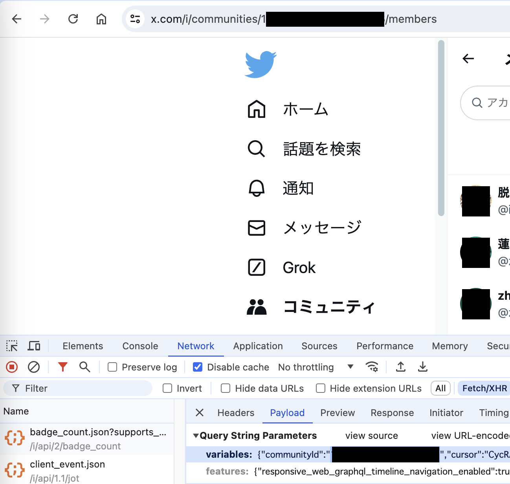

# Tweetzen: Tweet with ZEN(Alpha)

Block users who you don't like by using undocumented X(formly Twitter) APIs, provided by ```twikit```.

Currently supports block users who join the specified  X community.

## Usage
```python
# Replace these values with your own login credentials
USERNAME = 'YOUR_X_USERNAME'
PASSWORD = 'YOUR_X_PASSWORD'
USE_CACHE = False # For the first time, must be False
```
```python
community_users = get_community_users('The community id')
# Use Dev Tools to get community id from X Web
```
```bash
# Input 2FA code if required
# If error keeps occuring(possible you are hitting rate limit), try re-login
python3 ./tweetzen.py
```

## Get Community ID


## Todo
- Ban all users following the specefied one you don't like.